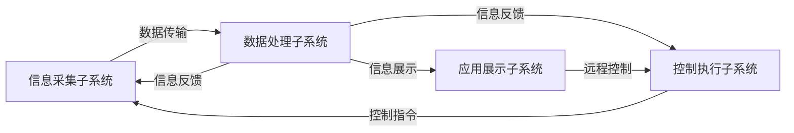
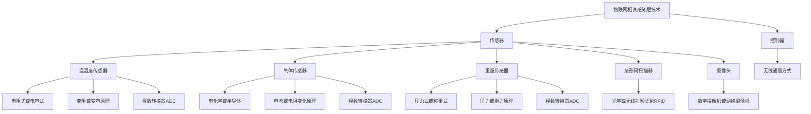

## 方法
### 定义法

*****

### 公式法
1. 三角行列式
2. 分块行列式——拉普拉斯展开式，**用倍加不变去凑 0**
$$
\left | \begin{matrix}
A& C \\
0& B \\
\end{matrix} \right | 
=
\left | \begin{matrix}
A& 0 \\
C& B \\
\end{matrix} \right | 
= |A||B|   
$$
$$
\left | \begin{matrix}
C& A \\
B& 0 \\
\end{matrix} \right | 
=
\left | \begin{matrix}
0& A \\
B& C \\
\end{matrix} \right | 
= (-1)^{mn}|A||B|   
$$

3. 范德蒙行列式
课本例 1.15commit id: "Normal" tag: "v1.0.0"commit id: "Normal" tag: "v1.0.0"

*****

### 化三角法
顾名思义，针对“爪”型行列式，把它的某一列或某一行化为 0，变成一个上/下三角行列式，根据主副对角线相乘求解。 
课本例 1.18，p19 红色部分

### 递推法
**明确使用对象：三对角线行列式!**
递推法和归纳法有异曲同工之妙，他俩可以说是两种相反方向去求解，先说说递推：
先按列展开，得到 $D_n = pD_{n-1} + q 或者 D_n = pD_{n-1} + qD_{n-2}$，但是到后续我们都不使用这种方法，使用**差分方程法**，后面会再介绍，但这个方法也需要了解。

课本例 1.21， 1.22
*****
### 数学归纳法
**明确使用对象：三对角线行列式!**

课本例 1.21， 1.22
*****
### 差分方程法
 $D_n = pD_{n-1} + q$ 这个是一阶一阶差方（一个相邻项）
  $D_n = pD_{n-1} + qD_{n-2}$ 这个是这个是二阶差方（两个相邻项）

