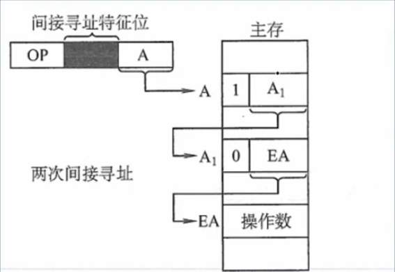

# 数据寻址
一地址指令格式一般如下：

  

    
OP

  

  

    
寻址方式 = 看情况

  

  

    
EA = A

  

## 直接寻址
形式地址 A 就是操作数真实地址，即 EA = A

优点：简单、指令执行阶段仅仅访问一次主存，不需要设计专门计算操作数的地址
缺点：A 的位数限制了寻址的范围，而且操作数的地址不容易更改

联想 C 语言指针，int * p = .... 其中 p 保存的就是数据的地址，所以此处的 A 就是 p，两者一致

## 间接寻址
形式地址存储的并不是操作数的地址，而是操作数地址的地址（一次间接寻址）

对于二次间接寻址，说白了就是操作数地址的地址的地址，如下图：

$A1$ 存储了一个地址，**通过最高位为 1 我们可以知道该地址指向的不是最终操作数而是中间地址，反之最高位为 0 则可知指向的是最终操作数**

$A2$ 同样存储一个地址，但不同于 $A1$，它前面最高位为 0 ，说明它存储的地址指向操作数

优点：可以扩大寻址范围，便于编制程序
缺点：指令在执行阶段要多次访存，多次访存的寻址需根据存储字的最高位确定

## 寄存器寻址
A 直接给出操作数所在的寄存器编号，即 $EA = Ri$，其操作数在由 $Ri$ 所指的寄存器内

优点：指令在执行阶段不访问主存，只访问所在 CPU 内的寄存器，指令字短（可用寄存器数量有限 ）且执行速度块
缺点：寄存器价格昂贵，计算机中寄存器个数有限

## 寄存器间接寻址
寄存器 $Ri$ 中给出的不是一个操作数，而是操作数所在主存单元的地址

优点：比一般的间接寻址快很多
缺点：寄存器价格昂贵，而且在执行阶段需要访存

## 偏移寻址
### 基址寻址
将 CPU 中基址寄存器 BR ——对用户透明（也可以是通用寄存器，对用户不透明）的内容加上指令格式中的形式地址 A，而形成操作数的有效地址，即 $EA = (BR) + A$

优点：可以扩大寻址范围（跟 BR 的大小有关），用户不需要考虑自己的程序位于哪一块主存，有利于多道程序设计和编制浮动程序
缺点：寄存器价格昂贵，逻辑比较复杂

### 变址寻址
跟上述基址寻址基本一样，除了此处的寄存器是 $IX$ 而基址寻址的寄存器是 $BR$ 

优点：可以扩大寻址范围；在数组处理方面，可以设 $A$ 为数组的首地址，不断改变 $IX$，所以所以十分适合编制循环程序。
缺点：寄存器价格昂贵，逻辑比较复杂

### ⭐相对寻址
把程序计数器 $PC$ 的内容加上指令格式中的形式地址 $A$ 而形成操作数的有效地址，即 $EA = (PC) + A$ ，其中 $A$ 是相对于当前指令地址的位移量，可正可负，（题目没有明确说明的话）补码表示（题目如果特别说明就按题目）

优点：操作数的地址不是固定的，随 $PC$ 的变化而变化，并且与指令地址之间总是相差一个固定值，因此便于程序浮动，广泛用于转移指令。

缺点：寄存器价格昂贵，逻辑比较复杂

## 堆栈寻址
存储区中被读/写单元地址是用一个特定的寄存器给出的，该寄存器称为堆栈指针 $SP$

硬堆栈——寄存器构成的堆栈

软堆栈——内存单元构成的堆栈

两者区别主要体现在访存，如果使用硬堆栈，那么读数据不需要访存，反之需要多次访存。