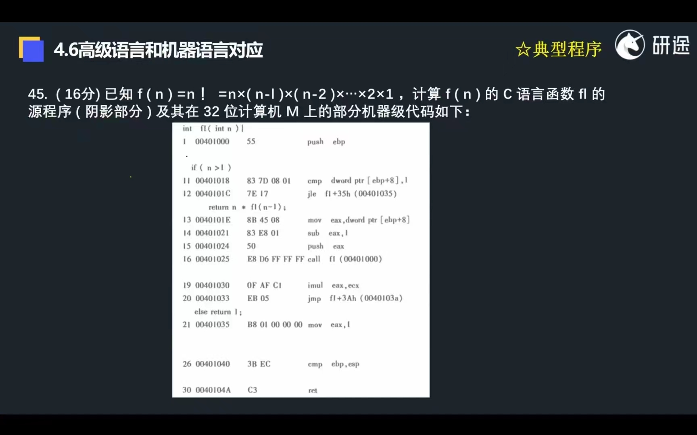
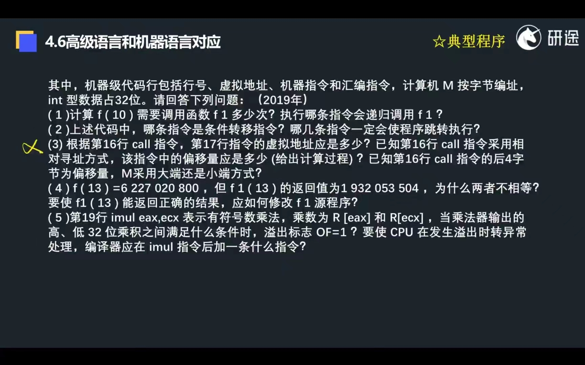
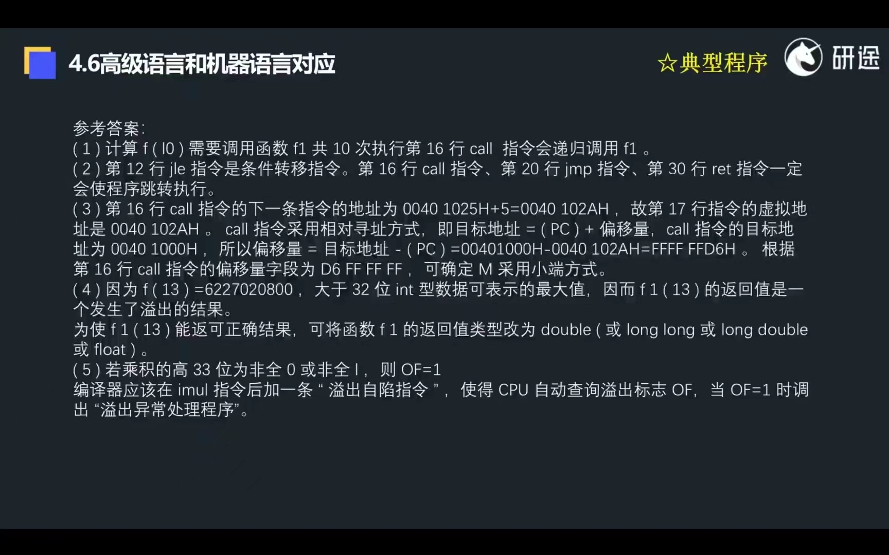
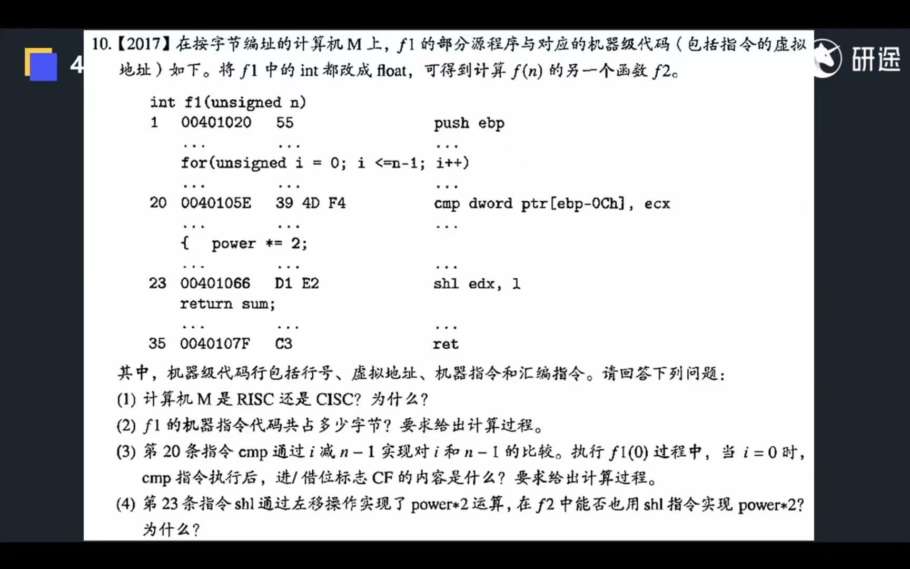
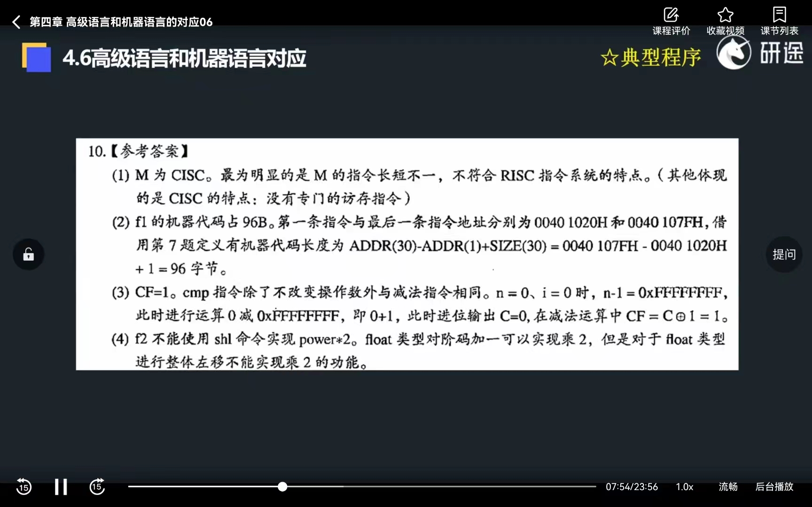
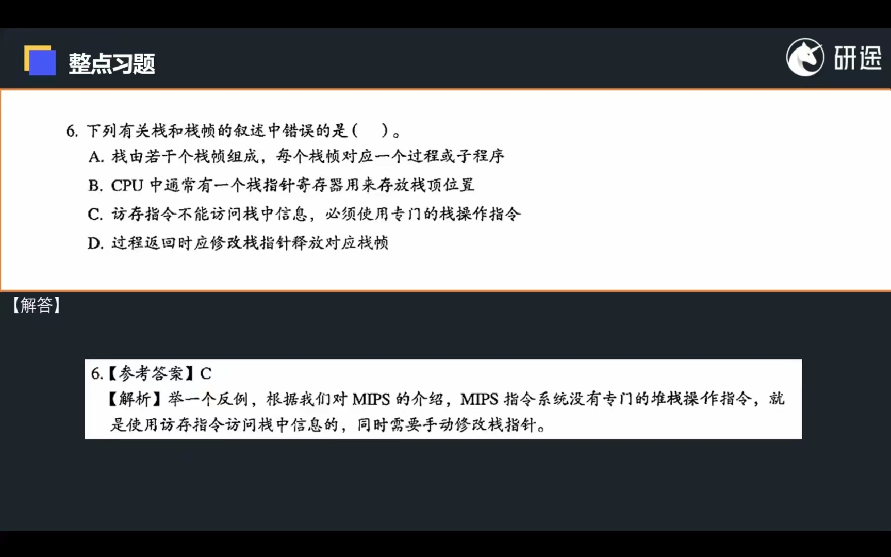

实例汇编第二行一个与运算，需要他的原因如下：
非在计算机体系结构中，内存是以字节为单位进行寻址和访问的，而栈通常也是以字节为单位进行操作的。在 x 86 体系结构中，栈通常是从高地址向低地址生长的，**而每个栈帧通常需要按照 16 字节的倍数对齐。**

具体来说，**按照 16 字节对齐的栈要求栈指针寄存器的值必须是 16 的倍数**。例如，如果栈指针 `esp` 的值为 `0x7fff1234`，则它不是按照 16 字节对齐的，因为它的最后一个字节是 ` 0x34`，而不是 `0x30`。为了将 ` esp ` 按照 16 字节对齐，需要将它的最后 4 位清零，即将其向下舍入到最近的 16 字节边界上。例如，将 ` esp ` 的值从 0 x 7 fff 1234 舍入到最近的 16 字节边界上，得到的值是 ` 0x7fff1230 `，它是按照  16  字节对齐的。

在汇编语言中，可以使用 `and` 指令来将栈指针舍入到最近的 16 字节边界上。具体来说，`and` 指令可以将栈指针的值与一个掩码进行按位与操作，使得栈指针的最后 4 位清零。例如，`and esp, 0xfffffff0` 操作可以将 `esp` 的值按照 16 字节对齐。

不论是 32 位还是 64 位的 x 86 计算机，x 86 栈都要按照 16 字节对齐。

在 x 86 架构中，栈是从高地址向低地址生长的，每个栈帧通常需要按照 16 字节的倍数对齐。这个对齐要求是由 x 86 架构所规定的，而不是由特定的操作系统或编译器所决定的。这样做的目的主要是为了提高内存访问的效率。

当栈指针没有对齐到 16 字节边界时，访问栈中的变量需要进行多次内存访问，这样会降低程序的执行效率。而当栈按照 16 字节对齐时，访问栈中的变量只需要进行一次内存访问，这样可以提高程序的执行效率。

因此，在 x 86 架构中，无论是 32 位还是 64 位，栈都要按照 16 字节对齐。这个规定在不同的操作系统和编译器中都是一样的。

## 题目

