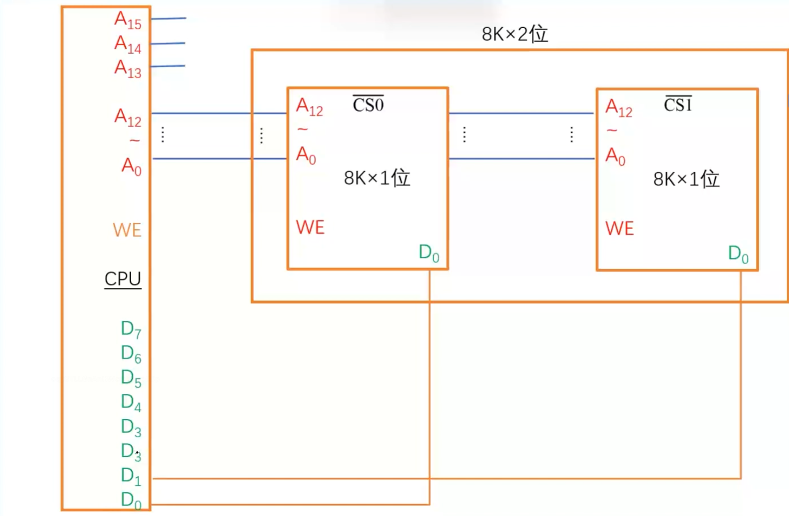
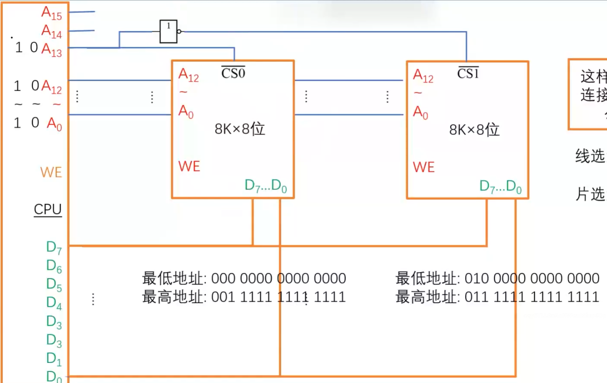

## 译码器
### 线选法
n 条地址线对应 n 个选片信号，**但是地址空间不连续**

#### 低电平有效
输出时每条输出线加入一个非电路（取反），其中一个目的是为了省电

假设我们希望输入的数据时 101，低电平有效是指把它取反，使得高电压

### 译码片选法
n 条条地址线对应 n 个选片信号，电路复杂但**地址空间连续**
![[主存1.png]]

### 使能端
控制输入译码器的信号稳定后再统一传入译码器，有点类似译码驱动器，只不过后者对象是译码器的输出信号。使能端可能会有多个输入端，比如 138 译码器

### 位扩展
扩展连接后存储单元数量不变，每个单元包含的位由 1 个变为 2 个
对于一个 8k * 1 位的芯片，把它扩展到 8K * 2 位就是所谓的位扩展。对于 8k * 1 位芯片，它有 13 根地址线和 1 根数据线，一共 14 根线。为了能够让 cpu **同时**访问两个芯片，两个芯片的数据线就要**分别连接**cpu 的数据线端口。

### 字扩展
扩展连接后存储单元包含的位数不变，存储单元的数目增多。
对于一个 8k * 8 位的芯片，由于字扩展**不需要同时**访问两个芯片，只需要确定**应该访问哪个芯片**即可，所以对于原先 13 根地址线肯定是不够的，因此需要**额外加入**地址线用于区分两个芯片。

地址中最高位（最左边一位）忽略

## 双端口 RAM
它有两套完全独立的数据线，地址线和读写控制线。
但同时也存在问题：两个端口对同一主存的操作有几种情况：
1. 同时对不同地址单元存储数据✔
2. 同时对同一地址单元读出数据✔
3. 同时对同一地址单元写入数据❌
4. 同时对同一地址单元，一个写入数据，一个读出数据❌
解决方案：设置“BUSY”信号，暂时关闭一个端口（被短暂延时），未被关闭的端口正常访问，被关闭的短暂延长后再访问

## 多模块存储器
### 单体多字存储器（类似位扩展）
原先单个存储单元只能存储 w 个字，现在变成 4w 个字，此时总线宽度也是 4w 个字，一次并行读出 4w 个字。
**指令和数据在主存内必须是连续存放的**

### 多体并行存储器
#### 高位交叉编址
高位地址表示体号，低位地址为体内地址：体号就是选择对存储体标号，体内地址就是在当前存储体内数据所在地址。
**特点：访问一个连续主存块时，总是先在一个模块内访问，等到该模块访问完才转到下一个模块访问。CPU 总是按顺序访问存储模块，存储模块不能被并行访问，因而不能提高存储器的吞吐率。**

|体号|体内地址|
|--|----|
|00 |0000|
| 00| 0001|
| 00 | 0010|
| $\vdots$ | $\vdots$ |
| 01| 0000|
| 01| 0001|
| $\vdots$ | $\vdots$ |

#### 低位交叉编址
低位地址表示体号，高位地址表示体内地址。
**特点：程序连续存放在相邻模块（因为下一个访问的对象一般都是相邻模块，除掉当前访问对象为最高体号的情况），采用低位交叉编址，可在不改变每个模块存取周期的前提下，采用流水线的方式存取，提高存储器的带宽，从而提升存储效率**

##### 低位交叉存取时间
模块书为 m，存储周期为 T，总线传输周期为 r **（存取时间）**，连续存取 n 个字，每隔 r 时间启动下一个存储体，连续存取 n 个字耗时为
$$
T + (n-1) r
$$
这种编址存取方式存在一定问题：
1. 当 $m < \frac{T}{t}$ 时
这种情况下，由于模块少，会导致 CPU 访问完所有模块一次后，发现没有更多模块可以访问，因为此时第一个被访问的模块还处于恢复时间，所以 CPU 需要等待第一个被访问模块恢复完成后才可以继续访问。
2. 当 $m > \frac{T}{t}$ 时
这种情况下，由于模块多，当第一次被访问的模块恢复完成——即完成了一个存储周期时，CPU 还还没有把全部模块访问一次——即有的模块还没有被访问，就会使得第一个被访问的模块需要等待一段时间后才能再度被 CPU 访问。
3. 当 $m = \frac{T}{t}$ 时
这种情况是最好的，可以使得存取效率最高，也是考试中如果考到会涉及到的一种情况

还需要著一个点，题目中如果只说到**交叉存储器**，默认都是**低位交叉编址**方式。

## 习题
1. 某计算机主存容量为 64 KB，其中 ROM 区为 4 KB，其余为 RAM 区，按字节编址。现要用 2 K * 8 位的 ROM 芯片和 4 K * 4 位的 RAM 芯片来设计该存储器，则需要上述规格的 ROM 芯片数和 RAM 芯片数分别是（）。【全国联考 2009 年】
A.1、15
B.2、15
C.1、30
D.2、30 
技巧：不需要管该主存是怎么实现字位扩展的，我们只需要根据 RAM 的大小计算出芯片数即可：
$$
\begin{align}
n(ROM) &= \frac{4k * 8}{2k * 8} = 2 \\
n(RAM) &= \frac{60k * 8}{4K * 4} = 30 \\
\bf{\text{答案选}D}
\end{align}
$$

2. 假定用若干个 2 K * 4 位的芯片组成一个 8 K *  8 位的存储器，则地址 0B1FH 所在芯片的最小地址是（）。【全国联考 2010 年】
A.0000 H
B.0600 H
C.0700 H
D.0800 H 
技巧： 题目说地址所在芯片的最小地址，因此地址范围仍然是 2k 个，而不是 8k 个。因此题目给出地址所在的低位（后 11 位）就是片内地址，高位是 2k * 8 的组号，此处为第二组（第一组组号高位全 0），因此该芯片最小地址就是高位包含组号低位全 0 的 0800H ，答案选 D

3. 某容量为 256 M 的存储器由若干 4 M * 8 位的 DRAM 芯片构成，该 DRAM 芯片的地址引脚和数据引脚总数是（）。【全国联考 2014 年】
A. 19
B. 22
C. 30
D. 36
技巧：先看清楚是 DRAM 还是 SRAM ，因为这决定了是否存在行列复用技术，此处为 DRAM 存在复用，那么地址引脚数最少是 22 / 2 = 11 根，数据引脚是 8 根，总共最少 19 根。（准确而言本题问法有疏漏，理论上大于等于 11 小于等于 22 的地址引脚数都没问题，因为原题没有说明是最多还是最少情况）

4. 某存储器容量为 64 KB，按字节编址，地址 4000H～5FFFH 为 ROM 区，其余为 RAM 区。若采用 8 K * 4 位的 SRAM 芯片进行设计，则需要该芯片的数量是（）。【全国联考 2016 年】
A.7
B.8
C.14
D.16 
技巧：通过地址计算 ROM 大小：$5FFFH - 4000H + 1H = 2000H = 8k$，所以 RAM 大小为 $64 - 8 = 56k$，芯片数量芯片数量等于：
$$
n(RAM) = \frac{56k * 8}{8k * 4} = 14
$$
 
 5. 某计算机使用 4 体交叉编址存储器，假定在存储器总线上出现的主存地址（十进制）序列为 8005，8006，8007，8008，8001，8002，8003，8004，8000，则可能发生访问冲突的地址对是（）。【全国联考 2015 年】
A．8004 和 8008
B．8002 和 8007 
C．8001 和 8008
D．8000 和 8004
技巧：由于是十进制地址，且 4 体交叉，我们可以通过把地址除以 4，余数为第 m 个存储体，所以有 $8005 \div 4 = 2001 \cdots 1$，说明第一个地址位于第 2 个存储体，同理可以知道 8006，8007 位于第 3，4 个存储体，8008，8001，8002，8003 位于第 1，2，3，4 个存储体，然而 $8004 \div 4 = 2001 \cdots 0 \quad 8000 \div 4 = 2000 \cdots 0$，发现它们都位于第 1 个存储体，相互冲突。
ps：为什么除以 4 余数就是存储体号，首先明确低位交叉，所以确定体号靠低位，因为题目是 4 体交叉，意味着在二进制表示下最末尾两位是体号，所以我们可以通过除以 4，模拟转换为 4 进制，得到最末尾的数（在四进制表示下），它恰好表示了最末尾两位的二进制数，所以可以得到体号。

 