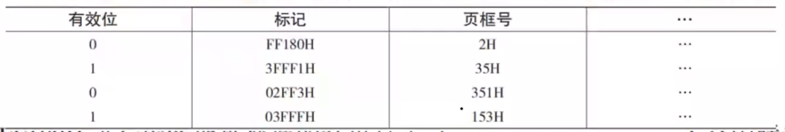

## 透明

任何硬件设备对应用程序员和系统程序员都透明，因为无法干涉硬件，硬件有它自己的操作模式，无法更改

但是软件技术是不一定的，是可以干涉的，因此对于系统程序员，这些软件技术对他们是不透明的，而对于应用程序员——可以理解类比为用户，是透明的——也就是不需要管这个技术是如何操作的，os 会处理好

## 虚拟存储器技术 && 虚拟内存技术 && 虚拟地址空间

虚拟内存技术和虚拟存储器技术是两个不同的概念。

虚拟内存技术是计算机操作系统中使用的一种技术，它将主存中暂时不需要的数据块存储到硬盘中，以便释放出主存的空间，当进程需要访问这些数据块时，再将它们从虚拟内存中读取到主存中。这样可以扩展主存的容量，提高系统的资源利用率和响应速度。

虚拟内存的容量，由两者的较小值来决定它的最大值：
1. 地址线根线（地址空间的上线，如果计算机时 32 位，那么它的地址空间上线就是 $2^{32}bits$）
2. 内存+外存
以上两者取较小值就是虚拟内存的最大容量

虚拟存储器技术是计算机系统中使用的一种技术，它允许用户使用比物理内存更大的内存空间，将数据交换到硬盘上的虚拟存储器中。在使用虚拟存储器技术的系统中，用户可以将硬盘上的一部分空间看作是内存，程序可以使用这部分空间，就像使用物理内存一样。虚拟存储器技术通常用于处理大型数据集或运行需要大量内存的程序。

虽然虚拟内存技术和虚拟存储器技术都涉及到将数据从主存中移出，但它们的实现方式、应用场景和目的都不同。虚拟内存技术主要用于扩展主存的容量，提高系统的性能和响应速度，而虚拟存储器技术主要用于扩展程序能够使用的内存空间，从而支持处理更大的数据集或更复杂的程序。

## 补充
分页虚拟存储器地址是一维的
分段虚拟存储器地址是二维的 

## 题目
Q：虚拟存储只能基于连续分配技术，这对吗
A：这句话不正确。虚拟存储技术不一定只能基于连续分配技术。

虚拟存储技术通常包括:

1. 连续分配技术: 如内存映射文件。这种技术将文件或对象映射到连续的虚拟地址空间, 使之具有连续分配的 illusion。但实际上, 文件可以 fragments 在物理磁盘上。

2. 分段技术: 将地址空间划分为大小相等的段, 每个段可以不连续地映射到物理存储器的不同区域。分段允许灵活地调整各段的大小和位置。

3. 分页技术: 将地址空间划分为固定大小的页, 页可以不连续地映射到物理存储器。分页技术更加灵活和效率高。

4. 基于对象的分配: 将存储空间划分为可变大小的对象, 每个对象都有一个唯一的标识, 对象可以不连续地存放在物理存储器中。

所以, 虚拟存储技术的实现有多种选择, 不仅限于连续分配技术。分段技术、分页技术以及基于对象的分配都不依赖于连续分配, 可以实现灵活高效的虚拟存储。

所以, 那句话过于绝对, 虚拟存储技术不一定只能基于连续分配。更精确的表述应该是: 虚拟存储技术可以基于连续分配, 但也可以基于其他非连续分配技术。

### 1．【全国联考 2013 年】

1. 某计算机主存地址空间大小为 256 MB，按字节编址。虚拟地址空间大小为 4 GB，采用页式存储管理，页面大小为 4 KB，TLB（快表）采用全相联映射，有 4 个页表项，内容如下表所示。

则对虚拟地址 03 FFF 180 H 进行虚头地址变换的结果是（）。
A.015 3180 H
B.003 5180 H
C.TLB 缺失
D.缺页 
【解答】把题目的空间大小变为位形式，主存 28 位，虚拟地址空间 32 位，页面大小 12 位，对于虚拟地址，由于映射方式位全相联映射，所以不存在组号，所以块号即为标记位——32-12=20 位。根据给出虚拟地址以及已知情况，可以得到真是物理地址页框号为 153 H，页框号即主存块号（页内偏移量），原页内地址为块内偏移量，拼接起来缺位高位补 0 答案为 A

### 3. 

3. 假定编译器将赋值语句“x= x+3；”转换为指令“add xaddr， 3” ，其中， xaddr 是 x 对应的存储单元地址。若执行该指令的计算机采用页式虚拟存储管理方式，并配有相应的 TLB，且 Cache 使用直写（WriteThrough）方式，则完成该指令功能需要访问主存的次数至少是（）。
【全国联考 2015 年】
A.0
B.1
C. 2
D.3
【解答】注意题目中问的是至少多少次，那么需要找到最小次数的情况。CPU 首先需要拿到 x 的值，CPU 得到的是个虚拟地址，先需要经过页表得到实页号，拼接后得到真实物理地址，然后再看 cache 中有没有，从而考虑是否需要访问主存。
既然是最少次数，那么就有一种可能：页表中存在该虚拟地址对应的页框号，即页表命中（如果缺页此处需要访问主存，如果题目问最多次数就要注意）。然后去 cache 中看看，发现也命中（最多次数时应该是不命中然后去主存中找），接下来时修改数据，根据直写法——应该就是写直通法，同步修改 cache 和主存，此处必定访问主存不论最少次数还是最多次数。
所以最终访问一次

### 4. 

4．虚拟存储器中关于页表、快表和慢表叙述中正确的是。 
A.快表与慢表都存储在主存中，但快表比慢表容量小
B.快表采用了优化搜索算法，因此查找速度快
C.快表采用高速存储器件组成，按查找内容访问，因此比慢表查找速度快
D.快表比慢表命中率高，可以得到更多的搜索结果
【解答】快表存储在相联存储器中，慢表存储在主存中，快表速度快是硬件原因不是算法设计，同时命中率一定是慢表高，因为快表的内容慢表都有，慢表有的快表不一定有。

